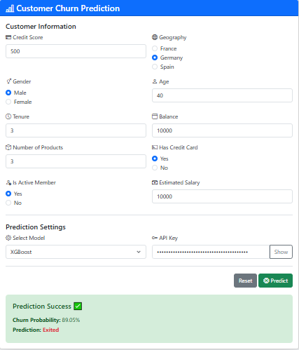

# Customer Churn Prediction API

## Overview
This project provides a robust REST API for predicting customer churn using multiple machine learning models. Built with FastAPI, it offers high-performance predictions using both Random Forest and XGBoost models, with secure API key authentication and comprehensive error handling.

## Features
- **Multiple ML Models**: Supports both Random Forest and XGBoost predictions
- **Secure Authentication**: API key-based access control
- **Fast Processing**: Asynchronous request handling with FastAPI
- **Cross-Origin Support**: Built-in CORS middleware for frontend integration
- **Error Handling**: Comprehensive error management and validation
- **Docker Support**: Containerized deployment ready

## Project Structure

```
.
├── assets/                    # Model files and preprocessing pipeline
│   ├── forest_tuned.pkl      # Trained Random Forest model
│   ├── preprocessor.pkl      # Data preprocessing pipeline
│   └── xgb_tuned.pkl        # Trained XGBoost model
│
├── dataset/                  # Training data directory
│   └── Churn_Modelling.csv  # Original dataset for model training
│
├── frontend/                # Web interface
│   └── index.html          # Interactive UI for model predictions
│
├── Misc/
│   └── AppScreen.PNG         # Application UI screen capture
│
├── notebooks/               # Jupyter notebooks for analysis
│   └── notebook.ipynb      # Model development and training notebook
│
├── utils/                   # Utility functions and configurations
│   ├── __init__.py
│   ├── config.py           # Configuration and model loading
│   ├── inference.py        # Prediction logic
│   └── request.py          # API request data models
│
├── .env                     # Environment variables (create from .env.example)
├── .env.example            # Example environment variables template
├── main.py                 # FastAPI application entry point
├── Dockerfile              # Docker configuration for containerization
└── requirements.txt        # Python package dependencies
```

## File Descriptions

### Core Files
- `main.py`: FastAPI application with API endpoints for predictions
- `Dockerfile`: Container configuration for Docker deployment
- `requirements.txt`: List of Python package dependencies

### Asset Files
- `assets/forest_tuned.pkl`: Trained Random Forest model for churn prediction
- `assets/xgb_tuned.pkl`: Trained XGBoost model for churn prediction
- `assets/preprocessor.pkl`: Scikit-learn preprocessing pipeline for data transformation

### Utility Modules
- `utils/config.py`: Configuration settings, model loading, and environment variables
- `utils/inference.py`: Functions for making predictions using the trained models
- `utils/request.py`: Pydantic models for API request validation

### Data and Analysis
- `dataset/Churn_Modelling.csv`: Dataset used for training the models
- `notebooks/notebook.ipynb`: Jupyter notebook containing model development process

### Frontend
- `frontend/index.html`: User-friendly web interface for making predictions

### Configuration
- `.env.example`: Template for environment variables
- `.env`: Active environment variables file (create from .env.example)

## Prerequisites
- Python 3.9+
- Docker (for containerized deployment)
- Required Python packages (see `requirements.txt`)

## Installation

### Local Development
1. Clone the repository:
```bash
git clone https://github.com/yourusername/churn-prediction-api.git
cd churn-prediction-api
```

2. Create and activate a virtual environment:
```bash
python -m venv venv
source venv/bin/activate  # On Windows: venv\Scripts\activate
```

3. Install dependencies:
```bash
pip install -r requirements.txt
```

4. Set up environment variables:
```bash
cp .env.example .env
# Edit .env file with your configuration
```

### Docker Deployment
1. Build the Docker image:
```bash
docker build -t churn-prediction-api .
```

2. Run the container:
```bash
docker run -d -p 8080:8080 churn-prediction-api
```

## 📊 Application Screenshots

### Data Processing


## API Documentation

### Authentication
All endpoints require API key authentication via the `X-API-Key` header:
```bash
X-API-Key: your-api-key-here
```

### Endpoints

#### 1. Health Check
```
GET /
```
Returns API status and version information.

#### 2. Random Forest Prediction
```
POST /predict/forest
```
Predicts customer churn using Random Forest model.

#### 3. XGBoost Prediction
```
POST /predict/xgboost
```
Predicts customer churn using XGBoost model.

### Request Format
```json
{
    "CreditScore": 0,
    "Geography": "France",
    "Gender": "Male",
    "Age": 18,
    "Tenure": 10,
    "Balance": 0,
    "NumOfProducts": 1,
    "HasCrCard": 0,
    "IsActiveMember": 0,
    "EstimatedSalary": 0
}
```

### Example Usage

Using Python requests:
```python
import requests

url = "http://localhost:8080/predict/forest"
headers = {
    "X-API-Key": "your-api-key",
    "Content-Type": "application/json"
}
data = {
    "CreditScore": 650,
    "Geography": "France",
    "Gender": "Male",
    "Age": 35,
    "Tenure": 5,
    "Balance": 75000,
    "NumOfProducts": 2,
    "HasCrCard": 1,
    "IsActiveMember": 1,
    "EstimatedSalary": 50000
}

response = requests.post(url, json=data, headers=headers)
print(response.json())
```

Using curl:
```bash
curl -X 'POST' \
  'http://localhost:8080/predict/forest' \
  -H 'accept: application/json' \
  -H 'X-API-Key: your-api-key' \
  -H 'Content-Type: application/json' \
  -d '{
    "CreditScore": 650,
    "Geography": "France",
    "Gender": "Male",
    "Age": 35,
    "Tenure": 5,
    "Balance": 75000,
    "NumOfProducts": 2,
    "HasCrCard": 1,
    "IsActiveMember": 1,
    "EstimatedSalary": 50000
  }'
```

## Environment Variables
Create a `.env` file based on `.env.example` with the following variables:
- `APP_NAME`: Application name
- `VERSION`: API version
- `SECRET_KEY_TOKEN`: API authentication key

## Model Information
The project includes pre-trained models:
- `forest_tuned.pkl`: Optimized Random Forest model
- `xgb-tuned.pkl`: Tuned XGBoost model
- `preprocessor.pkl`: Data preprocessing pipeline

The models were trained on the `churn-data.csv` dataset, and the training process is documented in `notebooks/notebook.ipynb`.

## Error Handling
The API implements comprehensive error handling:
- 400: Bad Request (Invalid input data)
- 403: Forbidden (Invalid API key)
- 500: Internal Server Error (Prediction errors)

## Contributing
1. Fork the repository
2. Create a feature branch: `git checkout -b feature-name`
3. Commit changes: `git commit -am 'Add feature'`
4. Push to the branch: `git push origin feature-name`
5. Submit a Pull Request

## License
This project is licensed under the MIT License - see the LICENSE file for details.

## Support
For support, please open an issue in the GitHub repository or contact the maintainers.

## Quick Start

### 1. Environment Setup

```bash
# Clone the repository
git clone [your-repo-url]
cd End-to-End-Churn-Classification-Project

# Create and activate virtual environment (Windows)
python -m venv venv
.\venv\Scripts\activate

# Install dependencies
pip install -r requirements.txt

# Set up environment variables
cp .env.example .env
# Edit .env file with your SECRET_KEY_TOKEN
```

### 2. Running the Application

#### Option 1: Running Locally

```bash
# Start the FastAPI server
python main.py
```

The API will be available at http://localhost:8000

#### Option 2: Using Docker

```bash
# Build the Docker image
docker build -t churn-prediction .

# Run the container
docker run -p 8000:8000 -d churn-prediction
```

### 3. Using the Web Interface

1. Open `frontend/index.html` in your web browser
2. Enter the required customer information
3. Provide your API key
4. Select the model (Random Forest or XGBoost)
5. Click "Predict" to get the churn prediction

### 4. API Endpoints

- `GET /` - Health check endpoint
- `POST /predict/forest` - Get prediction using Random Forest model
- `POST /predict/xgboost` - Get prediction using XGBoost model

All endpoints require an API key to be passed in the `X-API-Key` header.

### Example API Request

```bash
curl -X POST http://localhost:8000/predict/forest \
  -H "Content-Type: application/json" \
  -H "X-API-Key: your-api-key" \
  -d '{
    "Contract": "Month-to-month",
    "InternetService": "DSL",
    "MonthlyCharges": 50.0,
    "TotalCharges": 1000.0,
    "tenure": 12,
    "PhoneService": "Yes"
  }'
```

## Model Information

The project includes two pre-trained models:
1. Random Forest Classifier
2. XGBoost Classifier

Both models are trained on customer data with features including contract type, service subscriptions, charges, and tenure.

## Security

- API key authentication is required for all endpoints
- CORS is enabled with appropriate middleware
- Environment variables are used for sensitive information
